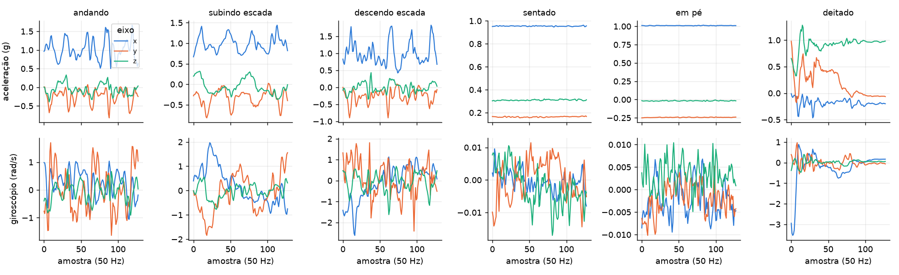
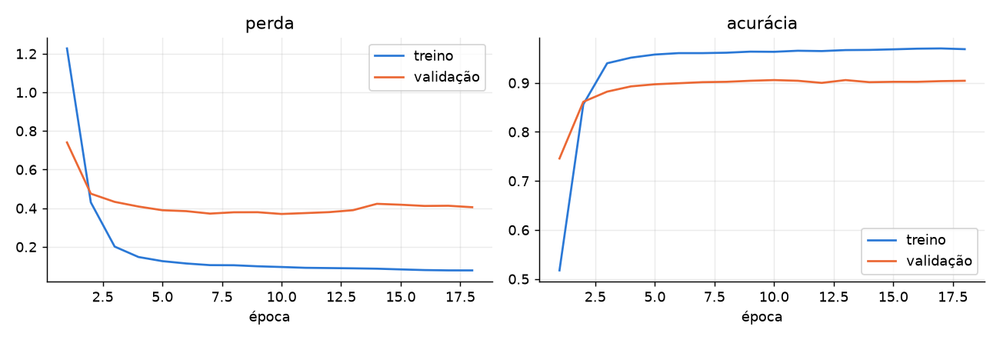
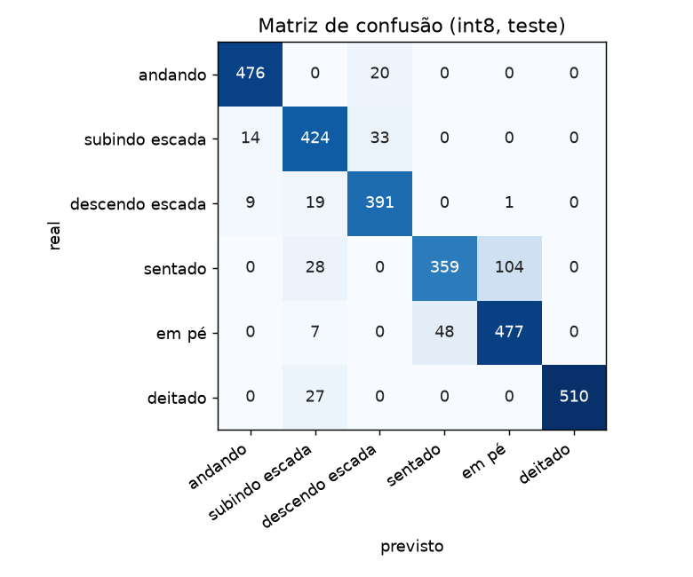

# Relatório: reconhecimento de atividade humana no ESP32-S3

Projeto final de IA Embarcada e Modelos Compactos. Um acelerômetro e um giroscópio medem o movimento, uma rede neural pequena classifica a atividade (andando, subindo escada, descendo escada, sentado, em pé ou deitado) e tudo roda dentro de um ESP32-S3 simulado no Wokwi. Os números abaixo foram medidos nas execuções descritas: TensorFlow 2.21, NumPy 2.4, ESP-IDF 5.5.5 e 6.1 e wokwi-cli 0.28.0.

## 1. O que foi feito

Os quatro passos do enunciado ficaram assim:

1. Coleta de dados de sensores. Usei o dataset público UCI HAR (acelerômetro e giroscópio de um celular na cintura). No chip, o sensor é um MPU6050, lido por I2C.
2. Treino com dataset público. Uma rede pequena treinada no notebook `treinamento/har_treino.ipynb`.
3. Conversão e compressão. O modelo foi convertido para TFLite em três versões (float32, faixa dinâmica e int8) e comparado.
4. Pipeline de inferência no dispositivo. O firmware lê o sensor, monta a janela, pré-processa, roda o modelo com o TensorFlow Lite Micro e imprime a atividade.

## 2. Dados

O UCI HAR tem 30 voluntários fazendo 6 atividades com um celular na cintura. Os sinais são medidos a 50 Hz e já vêm cortados em janelas de 128 amostras (2,56 s) com 50% de sobreposição. Usei 6 canais: aceleração total (x, y, z, em g) e giroscópio (x, y, z, em rad/s), que são os mesmos que o MPU6050 entrega.

O dataset já separa as pessoas: 21 no treino e 9 no teste. Tirei 4 pessoas do treino só para validação. No final ficaram 5952 janelas de treino, 1400 de validação e 2947 de teste. O teste mede pessoas que o modelo nunca viu.

Figura 1: uma janela de cada atividade. As caminhadas oscilam, e as atividades paradas ficam quase retas. Entre elas, o que muda é a orientação da gravidade.

Cada canal foi normalizado com a média e o desvio do treino. Esses 12 números vão para o firmware, que faz a mesma conta.

## 3. Modelo

A rede é pequena de propósito: duas convoluções (16 e 32 filtros, kernel 5), dois poolings, uma camada densa de 6 saídas e softmax. Tem 4630 parâmetros. Usei `Conv2D` com kernel `(5, 1)`, que equivale a uma convolução 1D, porque é a convolução com melhor suporte no TFLite Micro.

Treinei com Adam e parada antecipada pela perda de validação. Parou na época 18, e o modelo ficou com os pesos da época 10, a melhor na validação. O modelo final só usa 5 operações do TFLite: Reshape, Conv2D, MaxPool2D, FullyConnected e Softmax. Esse número só ficou assim depois de converter o modelo com batch fixo em 1. Com o batch dinâmico do Keras, o conversor adicionava mais três operações (Shape, StridedSlice e Pack) que o firmware não precisa.

Figura 2: perda e acurácia por época, no treino e na validação.

## 4. Resultados no conjunto de teste

| Modelo | Tamanho | Acurácia (2947 janelas) |
| --- | --- | --- |
| Float32 | 21860 B | 89,45% |
| Faixa dinâmica | 10120 B | 89,41% |
| Int8 completo | 9856 B | 89,48% |

A compressão para int8 deixou o arquivo mais de 2 vezes menor e a acurácia ficou igual (a diferença é de uma janela em 2947). As versões float e int8 deram a mesma resposta em 99,66% das janelas. O modelo int8 é o que vai para o chip.

Acerto por atividade no modelo int8:

| Atividade | Acerto |
| --- | --- |
| andando | 96,0% |
| subindo escada | 90,0% |
| descendo escada | 93,1% |
| sentado | 73,1% |
| em pé | 89,7% |
| deitado | 95,0% |

Figura 3: matriz de confusão do modelo int8. O maior erro é sentado previsto como em pé (104 de 491 janelas), e o contrário acontece em 48 de 532. São duas posturas paradas, e o celular na cintura sente quase a mesma coisa nas duas. Essa separação é o ponto fraco do modelo. Não testei formas de melhorar isso.

## 5. Firmware

O firmware está em `main/`, em arquivos separados por etapa:

- `sensor_mpu6050.cc`: lê o MPU6050 por I2C (SDA no GPIO 8, SCL no GPIO 9), 14 bytes por leitura, e converte para g e rad/s.
- `janela.cc`: buffer circular de 128 amostras. A primeira janela fica pronta na amostra 128 e as seguintes a cada 64 amostras.
- `preprocessamento.cc`: normaliza com a média e o desvio do treino e quantiza para int8.
- `classificador.cc`: carrega o modelo e roda o TFLite Micro.
- `main.cc`: junta tudo em dois modos.

No modo replay, o firmware roda 60 janelas reais do conjunto de teste (10 de cada atividade, sorteadas com semente fixa, sem escolher as que o modelo acerta) que ficam gravadas na flash. Ele compara a saída com a do PC. No modo live, lê o MPU6050 a 50 Hz.

A inferência no simulador leva cerca de 279 ms, bem mais que os 20 ms entre amostras. Por isso a leitura do sensor fica numa tarefa do FreeRTOS com prioridade maior, que monta a janela e avisa a tarefa principal. Com um laço só, a leitura do sensor ficaria parada durante cada inferência. O programa ocupa 465200 bytes (24% da partição de 1,9 MB). O modelo tem 9856 bytes, a arena do TFLite Micro usa 4524 dos 20480 bytes reservados, e as 60 janelas de demonstração ocupam cerca de 184 KB da flash.

## 6. Simulação no Wokwi

### 6.1 Replay

Rodei o firmware no wokwi-cli. Nas 60 janelas de demonstração:

| Medida | Resultado |
| --- | --- |
| Janelas classificadas certo | 58 de 60 (96,7%) |
| Saída int8 igual à do PC | 60 de 60 |
| Pré-processamento por janela | 10,8 ms |
| Inferência por janela | 279 ms |

Os dois erros foram uma subida de escada prevista como descida e um sentado previsto como em pé. A saída int8 do chip foi idêntica à do interpretador TFLite no PC nas 60 janelas, o que mostra que o firmware faz a mesma conta do notebook. Os 96,7% não são uma medida melhor do que os 89,5% do teste completo: 60 janelas é uma amostra pequena e é a mesma saída do PC.

Compilei e rodei com o ESP-IDF 5.5.5 e com o 6.1. As tabelas de resultado foram iguais. A única diferença foi o tempo de inferência (279 ms contra 276 ms). Cada compilação teve 8 avisos, todos no código do `esp-tflite-micro`. Nenhum no código do projeto.

### 6.2 Modo live com o sensor simulado

O MPU6050 do Wokwi tem controles (`accelX/Y/Z` em g e `rotationX/Y/Z` em graus/s) que ficam parados. Para ele reproduzir movimento, criei cenários do wokwi-cli (`simulacao/cenarios/`) que mudam os controles a cada 20 ms com uma janela real do dataset. O firmware lê esses valores por I2C como se fossem do sensor.

Conferi as amostras que o firmware leu na janela de caminhada: as 128 amostras bateram com o dataset, com diferença máxima de 0,0003. Essa conta de conferência foi feita ligando uma opção de depuração do firmware, que imprime cada amostra. Ela fica desligada na versão entregue.

Rodei um cenário para cada atividade (a primeira janela de demonstração de cada uma). Resultado do modo live:

| Atividade real | Atividade prevista pelo chip | Probabilidade |
| --- | --- | --- |
| andando | andando | 1,00 |
| subindo escada | subindo escada | 1,00 |
| descendo escada | descendo escada | 0,89 |
| sentado | sentado | 0,76 |
| em pé | em pé | 0,98 |
| deitado | deitado | 1,00 |

Foi uma janela por atividade, então isso mostra que a cadeia sensor, janela, pré-processamento e modelo funciona de ponta a ponta. Não é uma medida de acurácia. Os logs seriais estão em `simulacao/logs/`.

Como teste extra, coloquei valores fixos no MPU6050 (a média da aceleração das janelas de demonstração de cada postura parada, com o giroscópio em zero), em `simulacao/posturas/`. O chip respondeu sentado (prob. 0,99), em pé (0,96) e deitado (1,00) nas três janelas seguidas de cada teste. Isso indica que as posturas paradas podem ser demonstradas só com os controles do sensor (eu apliquei esses valores por cenário e não testei pela interface do Wokwi). A caminhada só aparece com um cenário que reproduz o movimento.

## 7. Limitações

- Os kernels otimizados em assembly do ESP32-S3 não rodaram corretamente no Wokwi nos meus testes (a saída do modelo ficava travada num valor). Compilei com `CONFIG_NN_ANSI_C=y`. Por isso o tempo de 279 ms é do simulador com kernels em C e não diz quanto levaria numa placa real, onde eu não testei.
- O MPU6050 do Wokwi só se mexe pelo cenário, e o cenário reproduz uma janela por vez.
- O dataset foi gravado com um celular na cintura. Com o sensor em outro lugar ou outra orientação, o modelo precisaria de dados novos.
- A acurácia de sentado (73%) é baixa. Poderia melhorar com mais canais (o dataset também tem a aceleração do corpo sem a gravidade), com um modelo maior ou com mais dados, mas eu não testei essas opções.
- O modelo foi treinado uma vez. Não medi a variação entre treinos com sementes diferentes.

## 8. Conclusão

Um modelo de 4630 parâmetros, comprimido para 9856 bytes, reconhece 6 atividades com 89,5% de acerto em pessoas novas e roda no ESP32-S3 simulado, lendo um MPU6050. A compressão para int8 reduziu o arquivo mais de 2 vezes sem perder acurácia, e o firmware dá a mesma saída que o PC nas 60 janelas testadas. Falta testar em uma placa real e melhorar a diferença entre sentado e em pé.
